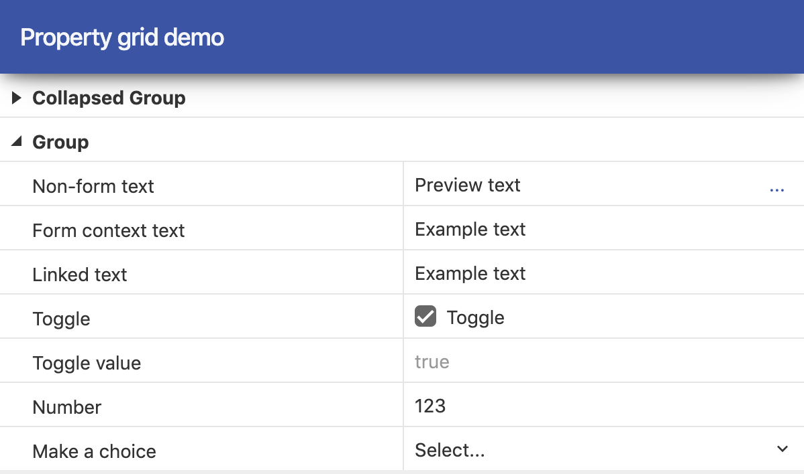

# TreeGridView & PropertyGridView

This package contains the `TreeGridView` and `PropertyGridView` components. These can be used to display hierarchical lists and grid controls in a Typescene application.

## Installation & Usage

**Note:** This component requires [Typescene](https://github.com/typescene/typescene) v2.21+.

To add one of these components to your application, add the NPM package first:

`npm i -D @typescene/treegrid`

Then import the `TreeGridView` and/or `PropertyGridView` classes (or `TreeGrid` and/or `PropertyGrid` for JSX views) using an import statement such as:

`import { PropertyGrid, PropertyGridRow } from "@typescene/treegrid"`

### JSX

Note that _rows_ within grids are NOT represented by UI components, hence these cannot be preset using JSX syntax.

The correct way to include a property grid component in JSX is as follows:

```tsx
import { PropertyGrid, PropertyGridRow } from "@typescene/treegrid";

export default (
  <PropertyGrid
    rows={[
      PropertyGridRow.with({
        label: "First row",
        // ...
      }),
      // ... etc.
    ]}
  />
);
```

## Demo

The `demo/` folder contains a working example.



Clone the source repository, and run the following commands:

- `npm install`
- `npm run build`
- `cd demo`
- `npm install`
- `npm start`

## Notes

The code in this repository is relatively complex, and probably not a good first project to look at if you're new to Typescene. There are two primary reasons for this:

1. The grid is rendered as a set of _columns_, rather than simply as rows. This means that all cells within a column are guaranteed to be of the same width, but it does mean that the implementation for updating cells within one row is more complicated than otherwise.
2. The implementation takes care of updating only the necessary cells when showing/hiding or updating particular rows. This is done using a linked list of visible cells.
