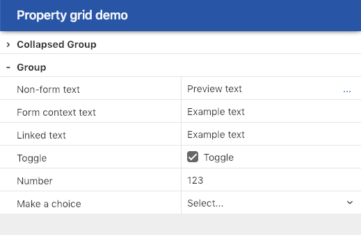

# TreeGrid & PropertyGrid

This package contains the `TreeGrid` and `PropertyGrid` components. These can be used to display hierarchical lists and grid controls in a Typescene application.

## Installation & Usage

To add a TreeGrid component to your application, add the NPM package first:

`npm install --save-dev @typescene/treegrid`

Then import the `TreeGrid` or `PropertyGrid` classes using an import statement such as:

`import { PropertyGrid, PropertyGridRow } from "@typescene/treegrid"`

The `demo/` folder contains a working example.

This component requires [Typescene](https://github.com/typescene/typescene) version 2.x.

## Demo

Clone the source repository, run `npm install` and then `npm start` to see the property grid in action.

